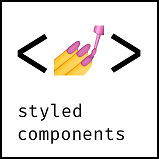
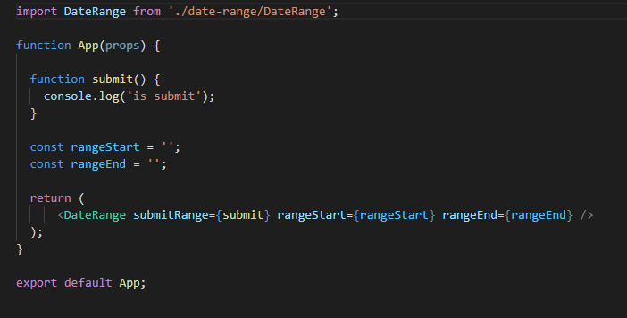

# my-react-calendar

* Equipe projet: Fr93562
* Date: 13/09/2020
* Version: 0.1
* Etat du projet: En phase de test

## Table des matières

## Contexte et utilité

Le but de ce projet est de mettre à disposition un composant rangePicker minimaliste et simple à utiliser. Il est destiné aux applications reactJs.

Il permet de sélectionner une date d'aujourd'hui jusqu'à il y a un an jour pour jour.

## Spécificités techniques

### Langage

Etant dans un esprit très minimaliste et très légère. Ce projet javascript utilise très peu de dépendances:

Il sera donc nécessaire d'utiliser styledComponent pour utilier ce projet.

### Architecture

Le point d'entrée du calendrier est DateRange.jsx.

Ce projet se décompose en trois parties:
* Les jobs contiennent toute la logique métier. Ce sont eux qui feront le pont entre les composants purements UI et les données.
* Les materials contiennent les composants UI. Ce qui inclue les éléments styled components qui sont commun aux différents composants. 
* Les providers fournissent les données à utiliser. Ils consomment l'api native date de javascript pour générer les intervalles.

### Implémentation

#### Etape 1

Cloner ce projet git

#### Etape 2

Vérifier que styled-component est bien installé dans le projet

#### Etape 3

Copier - coller le dossier date-Range dans votre projet

#### Etape 4 

L'importer:

* Dans cette exemple rangeStart et rangeEnd sont de simples variables. Il est nécessaire d'utiliser des states pour le bon fonctionnement du dateRange.
* Les dates générées sont au format JJ-MM-AAAA.
* submitOnRange est appelé au moment de la validation du calendrier

## A venir

* Ajout d'un menu pour séléctionner le mois